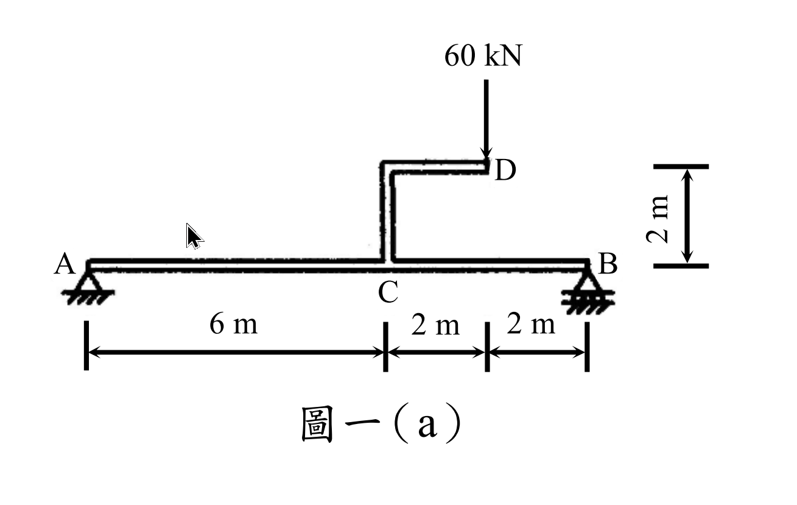
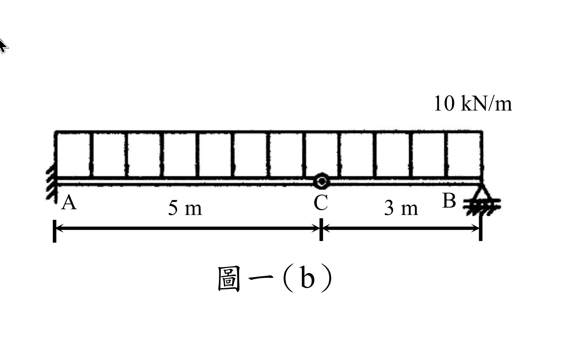

# MM-2008-1

**年份：** 2008（民國 97 年）第 1 題  
**主考點：** MM-U3-2（梁桿件變位及內力分析）  
**副考點：** 無  
**解析方法：** 彈性分析  
**標籤：** `剪力圖` · `彎矩圖` · `內鉸` · `支承反力` · `靜定梁` · `集中力偶` · `等值外力`

---

## 解析來源

[原始解析](../../raw/solutions/MM-2008-1/MM-2008-1.md)

## 互動圖

- [sfd-bmd 互動圖](../../raw/solutions/MM-2008-1/MM-2008-1-sfd-bmd-viz.html)

## 附圖

## 相關概念

> 概念連結在 ingest 時由解析內容自動萃取。

## 出現考點

| 考點 | 類型 |
|------|------|
| MM-U3-2（梁桿件變位及內力分析）| 主考點 |

*本頁由 `ingest MM-2008-1` 自動生成。最後更新：2026-06-29*
