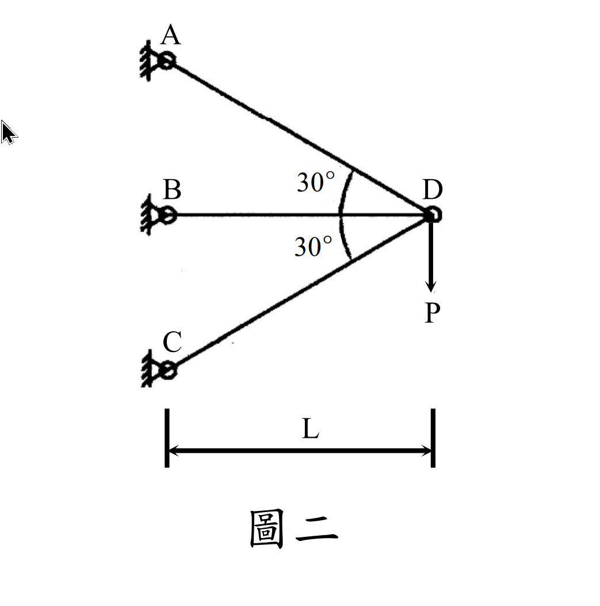

# MM-2008-2

**年份：** 2008（民國 97 年）第 2 題  
**主考點：** MM-U3-1（軸力桿件變位及內力分析）  
**副考點：** MM-U3-4（柱之挫屈載重分析）  
**解析方法：** 混合  
**標籤：** `三桿系統` · `靜不定軸力` · `節點位移` · `變形諧和` · `歐拉挫曲` · `安全係數` · `圓形斷面` · `有效長度`

---

## 解析來源

[原始解析](../../raw/solutions/MM-2008-2/MM-2008-2.md)

## 附圖

## 相關概念

> 概念連結在 ingest 時由解析內容自動萃取。

## 出現考點

| 考點 | 類型 |
|------|------|
| MM-U3-1（軸力桿件變位及內力分析）| 主考點 |
| MM-U3-4（柱之挫屈載重分析）| 副考點 |

*本頁由 `ingest MM-2008-2` 自動生成。最後更新：2026-06-29*
