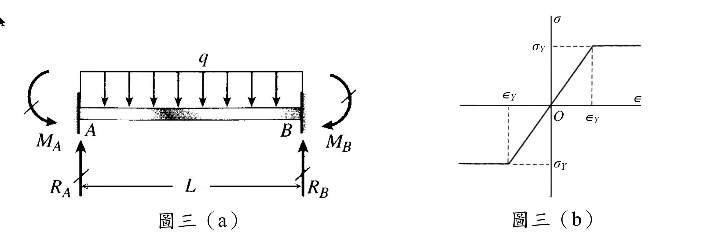

# MM-2008-3

**年份：** 2008（民國 97 年）第 3 題  
**主考點：** MM-U4-1（軸力桿件、扭力桿件與梁之塑性分析）  
**副考點：** MM-U3-2（梁桿件變位及內力分析）  
**解析方法：** 塑性分析  
**標籤：** `兩端固定梁` · `完全彈塑性` · `均布載重` · `降伏彎矩` · `塑性彎矩` · `塑性鉸` · `虛功原理` · `q-δ關係`

---

## 解析來源

[原始解析](../../raw/solutions/MM-2008-3/MM-2008-3.md)

## 互動圖

- [q-delta 互動圖](../../raw/solutions/MM-2008-3/MM-2008-3-q-delta-viz.html)

## 附圖

## 相關概念

> 概念連結在 ingest 時由解析內容自動萃取。

## 出現考點

| 考點 | 類型 |
|------|------|
| MM-U4-1（軸力桿件、扭力桿件與梁之塑性分析）| 主考點 |
| MM-U3-2（梁桿件變位及內力分析）| 副考點 |

*本頁由 `ingest MM-2008-3` 自動生成。最後更新：2026-06-29*
