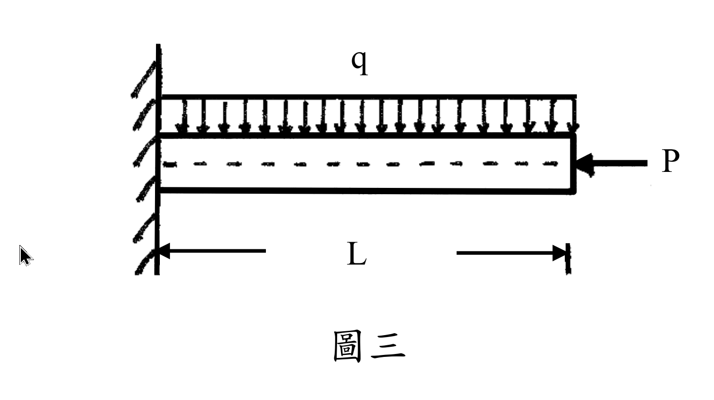

# MM-2009-4

**年份：** 2009（民國 98 年）第 4 題  
**主考點：** MM-U3-2（梁桿件變位及內力分析）  
**副考點：** MM-U3-4（柱之挫屈載重分析）  
**解析方法：** 混合  
**標籤：** `梁柱問題` · `懸臂梁` · `均布載重` · `軸向壓力` · `二階效應` · `挫屈` · `歐拉公式` · `固定自由端`

---

## 解析來源

[原始解析](../../raw/solutions/MM-2009-4/MM-2009-4.md)

## 互動圖

- [sfd-bmd 互動圖](../../raw/solutions/MM-2009-4/MM-2009-4-sfd-bmd-viz.html)

## 附圖

## 相關概念

> 概念連結在 ingest 時由解析內容自動萃取。

## 出現考點

| 考點 | 類型 |
|------|------|
| MM-U3-2（梁桿件變位及內力分析）| 主考點 |
| MM-U3-4（柱之挫屈載重分析）| 副考點 |

*本頁由 `ingest MM-2009-4` 自動生成。最後更新：2026-06-29*
