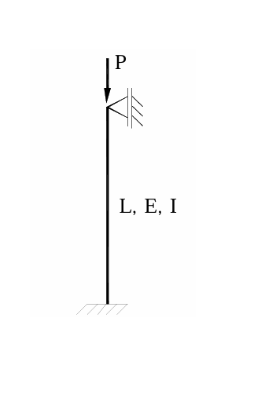

# MM-2010-1

**年份：** 2010（民國 99 年）第 1 題  
**主考點：** MM-U3-4（柱之挫屈載重分析）  
**副考點：** 無  
**解析方法：** 混合  
**標籤：** `歐拉挫屈` · `有效長度係數` · `積分法` · `固定鉸接柱` · `k值推導` · `微分方程` · `邊界條件` · `挫屈觀念`

---

## 解析來源

[原始解析](../../raw/solutions/MM-2010-1/MM-2010-1.md)

## 附圖

## 相關概念

> 概念連結在 ingest 時由解析內容自動萃取。

## 出現考點

| 考點 | 類型 |
|------|------|
| MM-U3-4（柱之挫屈載重分析）| 主考點 |

*本頁由 `ingest MM-2010-1` 自動生成。最後更新：2026-06-29*
