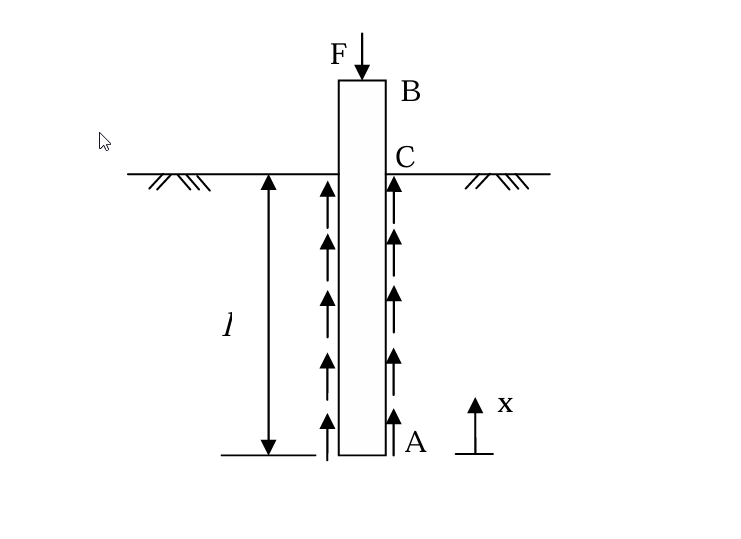

# MM-2011-2

**年份：** 2011（民國 100 年）第 2 題  
**主考點：** MM-U3-1（軸力桿件變位及內力分析）  
**副考點：** 無  
**解析方法：** 彈性分析  
**標籤：** `木樁` · `軸力圖` · `分布摩擦力` · `截面法` · `三次曲線軸力` · `靜定桿件`

---

## 解析來源

[原始解析](../../raw/solutions/MM-2011-2/MM-2011-2.md)

## 附圖

## 相關概念

> 概念連結在 ingest 時由解析內容自動萃取。

## 出現考點

| 考點 | 類型 |
|------|------|
| MM-U3-1（軸力桿件變位及內力分析）| 主考點 |

*本頁由 `ingest MM-2011-2` 自動生成。最後更新：2026-06-29*
