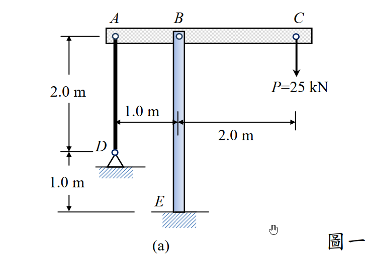
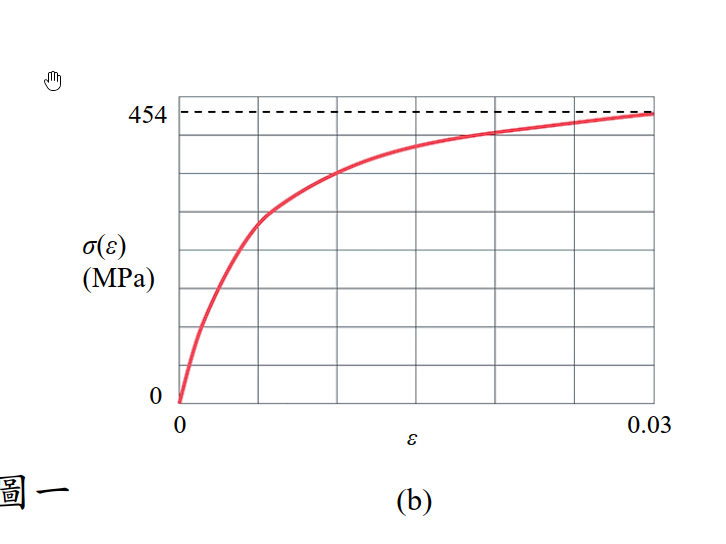

# MM-2013-1

**年份：** 2013（民國 102 年）第 1 題  
**主考點：** MM-U3-1（軸力桿件變位及內力分析）  
**副考點：** MM-U4-2（殘留應力與應變）  
**解析方法：** 塑性分析  
**標籤：** `非線性材料` · `靜不定軸力` · `剛性梁` · `纜線` · `永久變形` · `非線性σ-ε` · `彈性卸載` · `變形諧和`

---

## 解析來源

[原始解析](../../raw/solutions/MM-2013-1/MM-2013-1.md)

## 互動圖

- [stress-strain 互動圖](../../raw/solutions/MM-2013-1/MM-2013-1-stress-strain-viz.html)

## 附圖

## 相關概念

> 概念連結在 ingest 時由解析內容自動萃取。

## 出現考點

| 考點 | 類型 |
|------|------|
| MM-U3-1（軸力桿件變位及內力分析）| 主考點 |
| MM-U4-2（殘留應力與應變）| 副考點 |

*本頁由 `ingest MM-2013-1` 自動生成。最後更新：2026-06-29*
