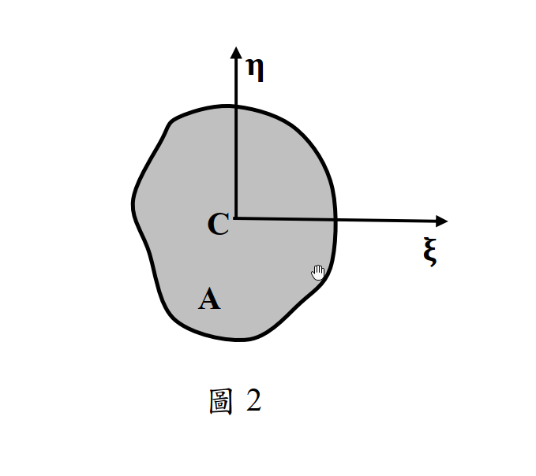

# MM-2014-2

**年份：** 2014（民國 103 年）第 2 題  
**主考點：** MM-U2-2（梁桿件斷面應力計算）  
**副考點：** MM-U1-1（斷面性質計算）  
**解析方法：** 彈性分析  
**標籤：** `廣義撓曲公式` · `主慣性軸` · `雙軸彎曲` · `軸力疊加` · `正向纖維應力` · `積分推導` · `形心主軸` · `應力合成`

---

## 解析來源

[原始解析](../../raw/solutions/MM-2014-2/MM-2014-2.md)

## 附圖

## 相關概念

> 概念連結在 ingest 時由解析內容自動萃取。

## 出現考點

| 考點 | 類型 |
|------|------|
| MM-U2-2（梁桿件斷面應力計算）| 主考點 |
| MM-U1-1（斷面性質計算）| 副考點 |

*本頁由 `ingest MM-2014-2` 自動生成。最後更新：2026-06-29*
