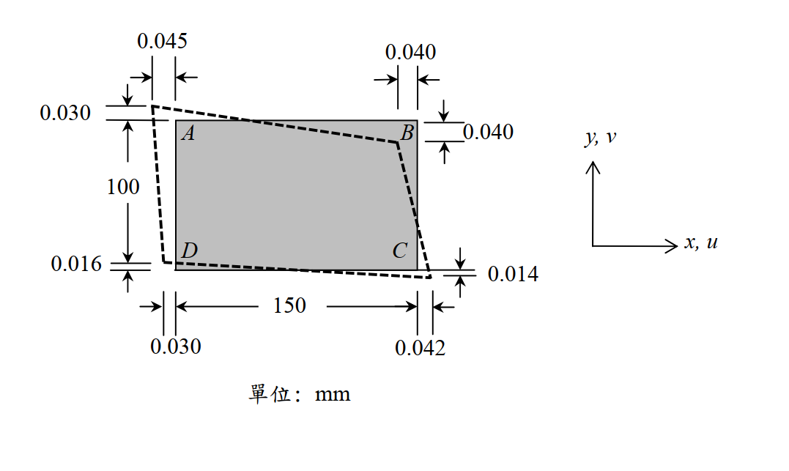

# MM-2015-3

**年份：** 2015（民國 104 年）第 3 題  
**主考點：** MM-U1-3（應力及應變分析原理與應用）  
**副考點：** 無  
**解析方法：** 彈性分析  
**標籤：** `平面應變` · `矩形板` · `廣義虎克定律` · `主應變` · `莫爾圓應變` · `最大剪應變` · `應力元素圖` · `平面應力`

---

## 解析來源

[原始解析](../../raw/solutions/MM-2015-3/MM-2015-3.md)

## 互動圖

- [mohr 互動圖](../../raw/solutions/MM-2015-3/MM-2015-3-mohr-viz.html)

## 附圖

## 相關概念

> 概念連結在 ingest 時由解析內容自動萃取。

## 出現考點

| 考點 | 類型 |
|------|------|
| MM-U1-3（應力及應變分析原理與應用）| 主考點 |

*本頁由 `ingest MM-2015-3` 自動生成。最後更新：2026-06-29*
