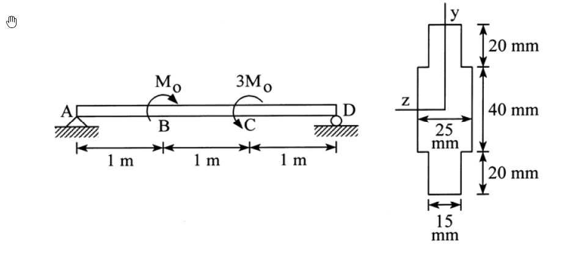

# MM-2016-1

**年份：** 2016（民國 105 年）第 1 題  
**主考點：** MM-U2-2（梁桿件斷面應力計算）  
**副考點：** MM-U3-2（梁桿件變位及內力分析）  
**解析方法：** 彈性分析  
**標籤：** `簡支梁` · `集中彎矩` · `T形截面` · `形心` · `慣性矩` · `最大正向應力` · `最大剪應力` · `彎矩剪力圖` · `非對稱截面`

---

## 解析來源

[原始解析](../../raw/solutions/MM-2016-1/MM-2016-1.md)

## 附圖

## 相關概念

> 概念連結在 ingest 時由解析內容自動萃取。

## 出現考點

| 考點 | 類型 |
|------|------|
| MM-U2-2（梁桿件斷面應力計算）| 主考點 |
| MM-U3-2（梁桿件變位及內力分析）| 副考點 |

*本頁由 `ingest MM-2016-1` 自動生成。最後更新：2026-06-29*
