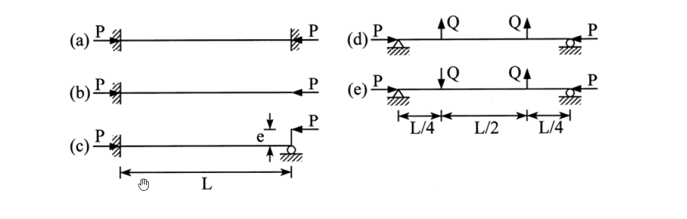

# MM-2016-2

**年份：** 2016（民國 105 年）第 2 題  
**主考點：** MM-U3-4（柱之挫屈載重分析）  
**副考點：** 無  
**解析方法：** 彈性分析  
**標籤：** `柱挫屈` · `Euler公式` · `等效長度` · `臨界載重` · `屈曲模態` · `邊界條件` · `固定端` · `自由端` · `鉸支端` · `偏心載重`

---

## 解析來源

[原始解析](../../raw/solutions/MM-2016-2/MM-2016-2.md)

## 附圖

## 相關概念

> 概念連結在 ingest 時由解析內容自動萃取。

## 出現考點

| 考點 | 類型 |
|------|------|
| MM-U3-4（柱之挫屈載重分析）| 主考點 |

*本頁由 `ingest MM-2016-2` 自動生成。最後更新：2026-06-29*
