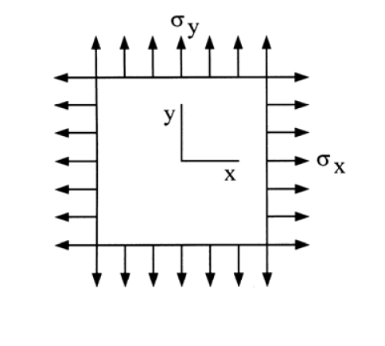

# MM-2016-4

**年份：** 2016（民國 105 年）第 4 題  
**主考點：** MM-U1-2（虎克定律應用）  
**副考點：** MM-U1-3（應力及應變分析原理與應用）  
**解析方法：** 彈性分析  
**標籤：** `三軸應力` · `廣義虎克定律` · `彈性模數` · `柏松比` · `主應力` · `最大剪應力` · `Mohr圓` · `平面應力`

---

## 解析來源

[原始解析](../../raw/solutions/MM-2016-4/MM-2016-4.md)

## 附圖

## 相關概念

> 概念連結在 ingest 時由解析內容自動萃取。

## 出現考點

| 考點 | 類型 |
|------|------|
| MM-U1-2（虎克定律應用）| 主考點 |
| MM-U1-3（應力及應變分析原理與應用）| 副考點 |

*本頁由 `ingest MM-2016-4` 自動生成。最後更新：2026-06-29*
