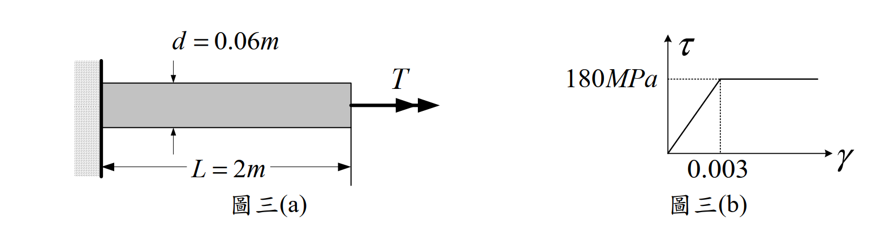

# MM-2018-3

**年份：** 2018（民國 107 年）第 3 題  
**主考點：** MM-U4-2（殘留應力與應變）  
**副考點：** MM-U2-3（扭力桿件斷面應力計算）、MM-U3-3（扭力桿件變位及內力分析）  
**解析方法：** 塑性分析  
**標籤：** `實心圓桿` · `彈塑性扭轉` · `降伏扭矩` · `全塑性扭矩` · `殘留扭轉角` · `彈性卸載` · `理想彈塑性`

---

## 解析來源

[原始解析](../../raw/solutions/MM-2018-3/MM-2018-3.md)

## 附圖

## 相關概念

> 概念連結在 ingest 時由解析內容自動萃取。

## 出現考點

| 考點 | 類型 |
|------|------|
| MM-U4-2（殘留應力與應變）| 主考點 |
| MM-U2-3（扭力桿件斷面應力計算）| 副考點 |
| MM-U3-3（扭力桿件變位及內力分析）| 副考點 |

*本頁由 `ingest MM-2018-3` 自動生成。最後更新：2026-06-29*
