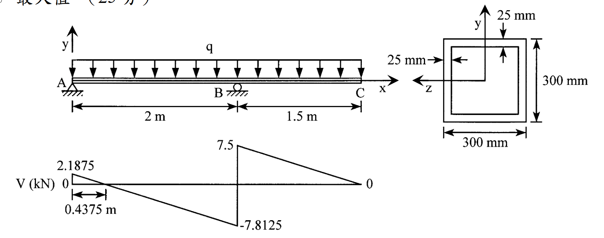

# MM-2019-2

**年份：** 2019（民國 108 年）第 2 題  
**主考點：** MM-U2-2（梁桿件斷面應力計算）  
**副考點：** MM-U3-2（梁桿件變位及內力分析）、MM-U1-1（斷面性質計算）  
**解析方法：** 彈性分析  
**標籤：** `箱型梁` · `均布載重` · `彎矩圖` · `箱型斷面剪應力` · `彎曲正向應力` · `靜定梁分析`

---

## 解析來源

[原始解析](../../raw/solutions/MM-2019-2/MM-2019-2.md)

## 互動圖

- [beam 互動圖](../../raw/solutions/MM-2019-2/MM-2019-2-beam-viz.html)

## 附圖

## 相關概念

> 概念連結在 ingest 時由解析內容自動萃取。

## 出現考點

| 考點 | 類型 |
|------|------|
| MM-U2-2（梁桿件斷面應力計算）| 主考點 |
| MM-U3-2（梁桿件變位及內力分析）| 副考點 |
| MM-U1-1（斷面性質計算）| 副考點 |

*本頁由 `ingest MM-2019-2` 自動生成。最後更新：2026-06-29*
