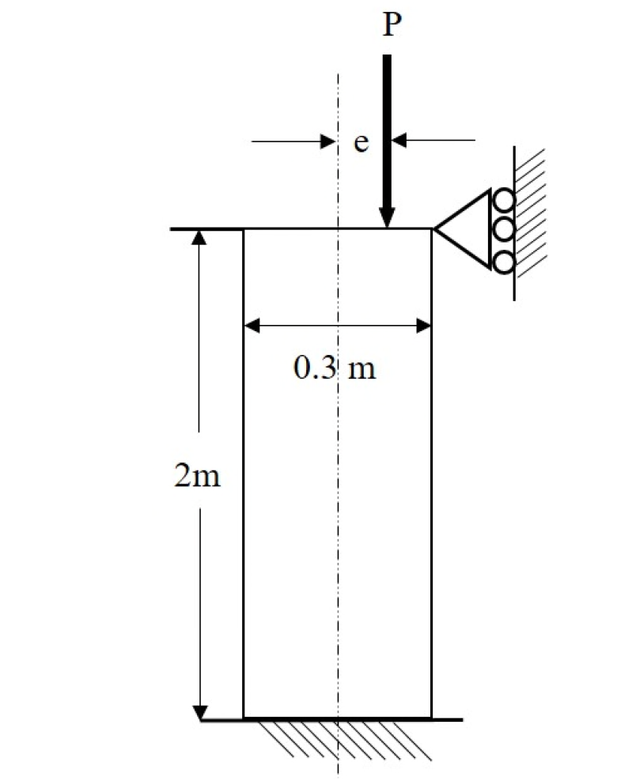

# MM-2020-3

**年份：** 2020（民國 109 年）第 3 題  
**主考點：** MM-U2-1（軸力桿件斷面應力計算）  
**副考點：** MM-U3-1（軸力桿件變位及內力分析）  
**解析方法：** 彈性分析  
**標籤：** `偏心受壓柱` · `最大壓應力` · `核心距` · `不出現拉應力` · `靜不定柱` · `彎矩分析`

---

## 解析來源

[原始解析](../../raw/solutions/MM-2020-3/MM-2020-3.md)

## 互動圖

- [eccentric 互動圖](../../raw/solutions/MM-2020-3/MM-2020-3-eccentric-viz.html)

## 附圖

## 相關概念

> 概念連結在 ingest 時由解析內容自動萃取。

## 出現考點

| 考點 | 類型 |
|------|------|
| MM-U2-1（軸力桿件斷面應力計算）| 主考點 |
| MM-U3-1（軸力桿件變位及內力分析）| 副考點 |

*本頁由 `ingest MM-2020-3` 自動生成。最後更新：2026-06-29*
