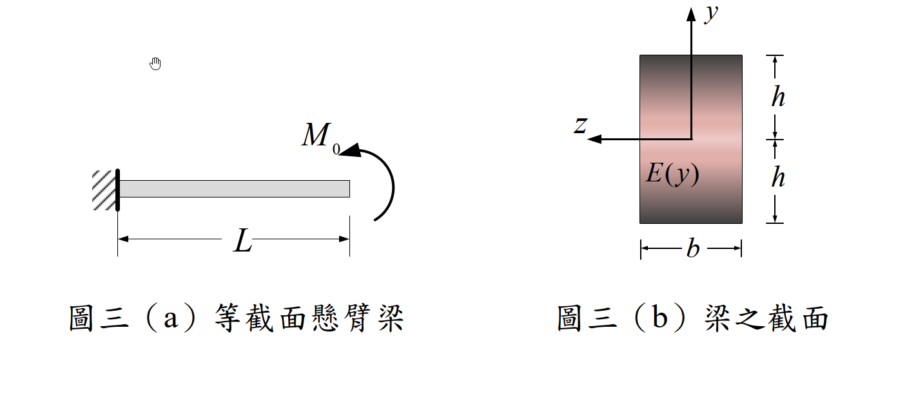

# MM-2021-3

**年份：** 2021（民國 110 年）第 3 題  
**主考點：** MM-U2-2（梁桿件斷面應力計算）  
**副考點：** 無  
**解析方法：** 彈性分析  
**標籤：** `非均質梁` · `楊氏模數漸變` · `純彎曲` · `平面截面假設` · `積分求彎曲剛度` · `應力分布`

---

## 解析來源

[原始解析](../../raw/solutions/MM-2021-3/MM-2021-3.md)

## 互動圖

- [section 互動圖](../../raw/solutions/MM-2021-3/MM-2021-3-section-viz.html)

## 附圖

## 相關概念

> 概念連結在 ingest 時由解析內容自動萃取。

## 出現考點

| 考點 | 類型 |
|------|------|
| MM-U2-2（梁桿件斷面應力計算）| 主考點 |

*本頁由 `ingest MM-2021-3` 自動生成。最後更新：2026-06-29*
