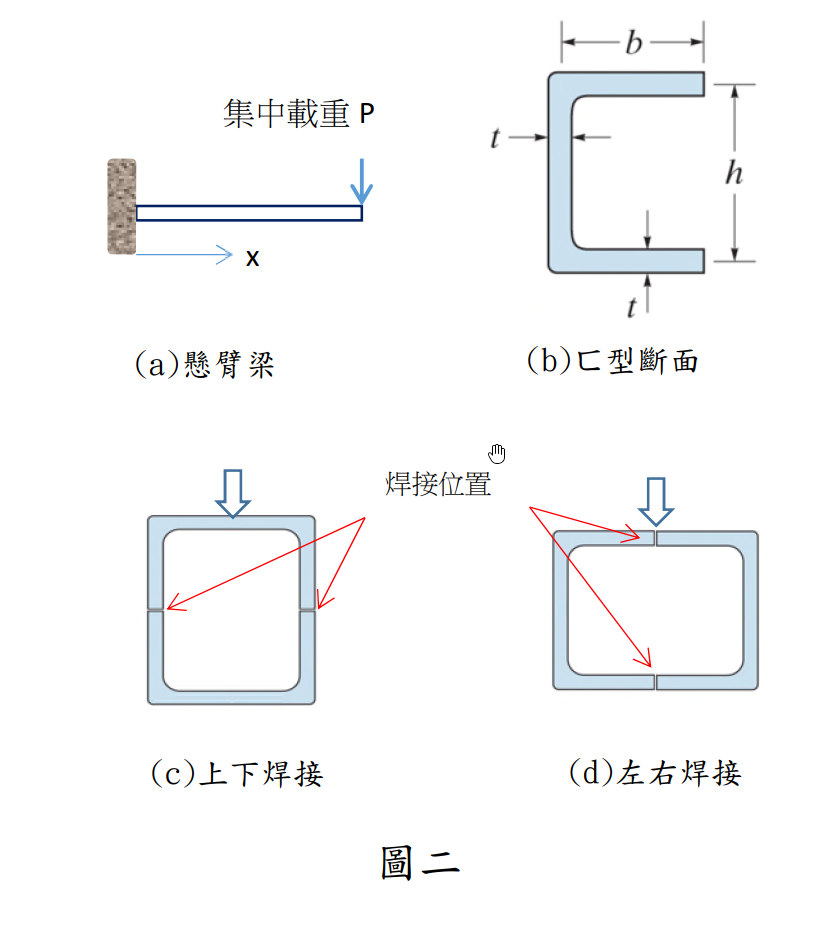

# MM-2023-2

**年份：** 2023（民國 112 年）第 2 題  
**主考點：** MM-U2-2（梁桿件斷面應力計算）  
**副考點：** 無  
**解析方法：** 彈性分析  
**標籤：** `剪力流` · `箱型斷面` · `C型槽組合` · `焊接剪力` · `剪力中心` · `VQ/Ib` · `薄壁斷面` · `剪力流積分`

---

## 解析來源

[原始解析](../../raw/solutions/MM-2023-2/MM-2023-2.md)

## 互動圖

- [sfd-bmd 互動圖](../../raw/solutions/MM-2023-2/MM-2023-2-sfd-bmd-viz.html)

## 附圖

## 相關概念

> 概念連結在 ingest 時由解析內容自動萃取。

## 出現考點

| 考點 | 類型 |
|------|------|
| MM-U2-2（梁桿件斷面應力計算）| 主考點 |

*本頁由 `ingest MM-2023-2` 自動生成。最後更新：2026-06-29*
