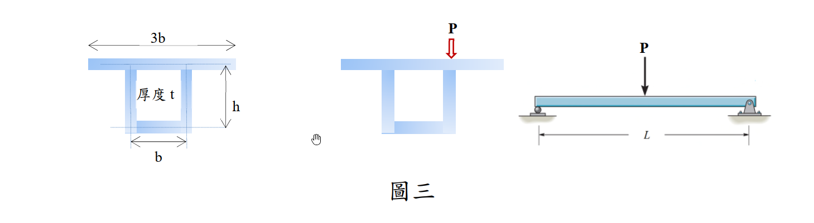

# MM-2023-3

**年份：** 2023（民國 112 年）第 3 題  
**主考點：** MM-U2-2（梁桿件斷面應力計算）  
**副考點：** MM-U2-3（扭力桿件斷面應力計算）  
**解析方法：** 彈性分析  
**標籤：** `工字型梁` · `彎曲應力` · `剪應力` · `剪力流` · `VQ/Ib` · `斷面性質` · `簡支梁` · `跨中載重` · `組合應力`

---

## 解析來源

[原始解析](../../raw/solutions/MM-2023-3/MM-2023-3.md)

## 互動圖

- [sfd-bmd 互動圖](../../raw/solutions/MM-2023-3/MM-2023-3-sfd-bmd-viz.html)

## 附圖

## 相關概念

> 概念連結在 ingest 時由解析內容自動萃取。

## 出現考點

| 考點 | 類型 |
|------|------|
| MM-U2-2（梁桿件斷面應力計算）| 主考點 |
| MM-U2-3（扭力桿件斷面應力計算）| 副考點 |

*本頁由 `ingest MM-2023-3` 自動生成。最後更新：2026-06-29*
