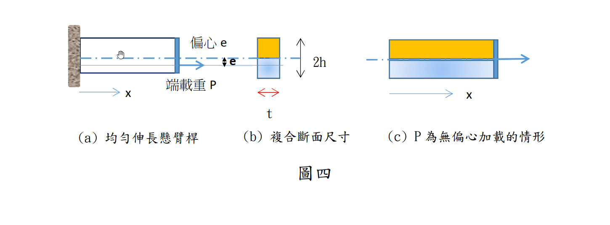

# MM-2023-4

**年份：** 2023（民國 112 年）第 4 題  
**主考點：** MM-U3-1（軸力桿件變位及內力分析）  
**副考點：** MM-U1-2（虎克定律應用）  
**解析方法：** 彈性分析  
**標籤：** `偏心軸力` · `複合斷面` · `雙材料梁` · `轉換斷面法` · `偏心彎矩` · `組合應力` · `均勻伸長` · `中性軸偏移`

---

## 解析來源

[原始解析](../../raw/solutions/MM-2023-4/MM-2023-4.md)

## 互動圖

- [section 互動圖](../../raw/solutions/MM-2023-4/MM-2023-4-section-viz.html)

## 附圖

## 相關概念

> 概念連結在 ingest 時由解析內容自動萃取。

## 出現考點

| 考點 | 類型 |
|------|------|
| MM-U3-1（軸力桿件變位及內力分析）| 主考點 |
| MM-U1-2（虎克定律應用）| 副考點 |

*本頁由 `ingest MM-2023-4` 自動生成。最後更新：2026-06-29*
