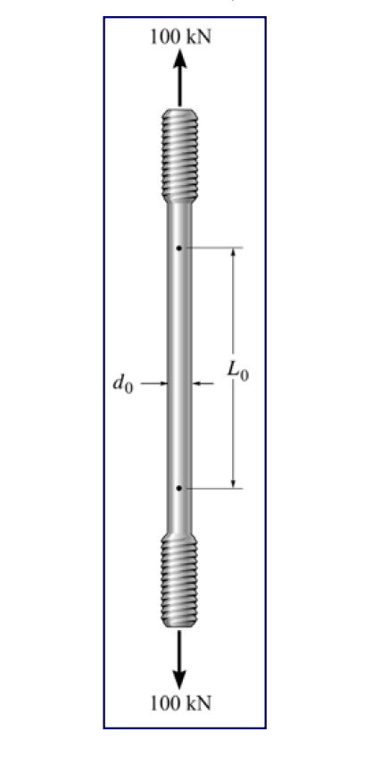

# MM-2024-1

**年份：** 2024（民國 113 年）第 1 題  
**主考點：** MM-U1-2（虎克定律應用）  
**副考點：** 無  
**解析方法：** 彈性分析  
**標籤：** `拉伸試驗` · `彈性模數` · `蒲松比` · `E-G-ν關係` · `側向應變` · `直徑收縮量`

---

## 解析來源

[原始解析](../../raw/solutions/MM-2024-1/MM-2024-1.md)

## 附圖

## 相關概念

> 概念連結在 ingest 時由解析內容自動萃取。

## 出現考點

| 考點 | 類型 |
|------|------|
| MM-U1-2（虎克定律應用）| 主考點 |

*本頁由 `ingest MM-2024-1` 自動生成。最後更新：2026-06-29*
