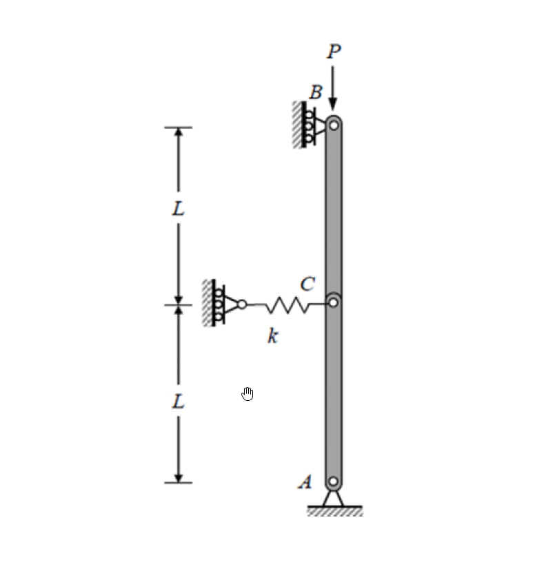

# MM-2024-3

**年份：** 2024（民國 113 年）第 3 題  
**主考點：** MM-U3-4（柱之挫屈載重分析）  
**副考點：** 無  
**解析方法：** 彈性分析  
**標籤：** `剛性桿挫屈` · `彈簧支撐` · `穩定性分析` · `擾動平衡法` · `能量法` · `臨界載重` · `單自由度系統`

---

## 解析來源

[原始解析](../../raw/solutions/MM-2024-3/MM-2024-3.md)

## 互動圖

- [buckling 互動圖](../../raw/solutions/MM-2024-3/MM-2024-3-buckling-viz.html)

## 附圖

## 相關概念

> 概念連結在 ingest 時由解析內容自動萃取。

## 出現考點

| 考點 | 類型 |
|------|------|
| MM-U3-4（柱之挫屈載重分析）| 主考點 |

*本頁由 `ingest MM-2024-3` 自動生成。最後更新：2026-06-29*
