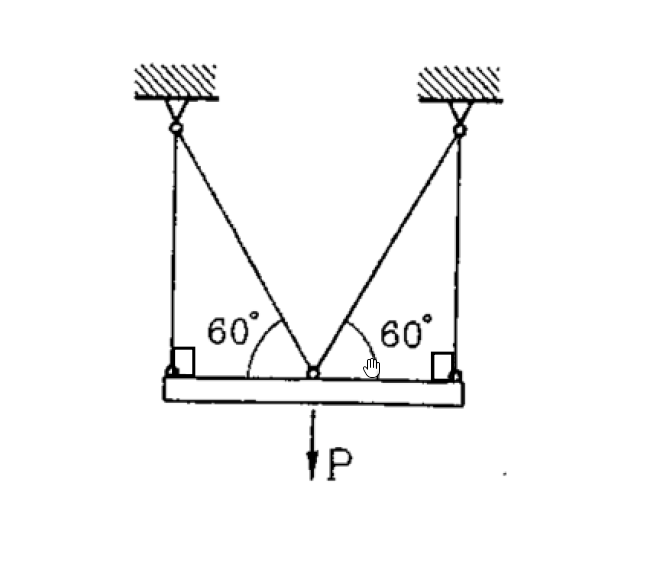

# MM-2024-4

**年份：** 2024（民國 113 年）第 4 題  
**主考點：** MM-U4-1（軸力桿件、扭力桿件與梁之塑性分析）  
**副考點：** 無  
**解析方法：** 塑性分析  
**標籤：** `理想彈塑性` · `塑性極限載重` · `纜繩系統` · `剛性梁` · `降伏順序` · `應力重分配` · `極限分析`

---

## 解析來源

[原始解析](../../raw/solutions/MM-2024-4/MM-2024-4.md)

## 附圖

## 相關概念

> 概念連結在 ingest 時由解析內容自動萃取。

## 出現考點

| 考點 | 類型 |
|------|------|
| MM-U4-1（軸力桿件、扭力桿件與梁之塑性分析）| 主考點 |

*本頁由 `ingest MM-2024-4` 自動生成。最後更新：2026-06-29*
