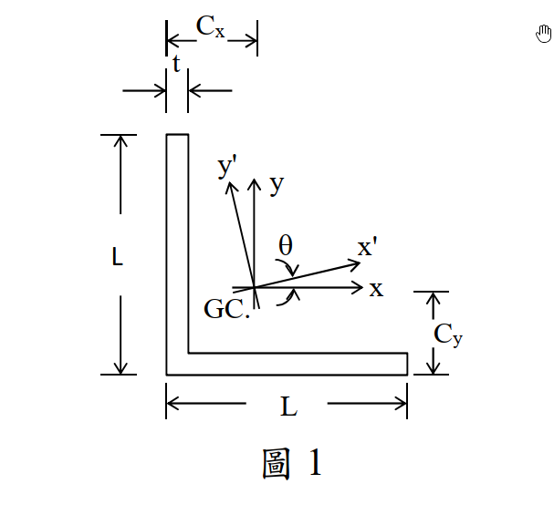

# MM-2025-1

**年份：** 2025（民國 114 年）第 1 題  
**主考點：** MM-U1-1（斷面性質計算）  
**副考點：** 無  
**解析方法：** 彈性分析  
**標籤：** `等肢角鋼` · `形心` · `平行軸定理` · `慣性積` · `主慣性矩` · `主軸角` · `慣性矩莫爾圓`

---

## 解析來源

[原始解析](../../raw/solutions/MM-2025-1/MM-2025-1.md)

## 互動圖

- [section 互動圖](../../raw/solutions/MM-2025-1/MM-2025-1-section-viz.html)

## 附圖

## 相關概念

> 概念連結在 ingest 時由解析內容自動萃取。

## 出現考點

| 考點 | 類型 |
|------|------|
| MM-U1-1（斷面性質計算）| 主考點 |

*本頁由 `ingest MM-2025-1` 自動生成。最後更新：2026-06-29*
