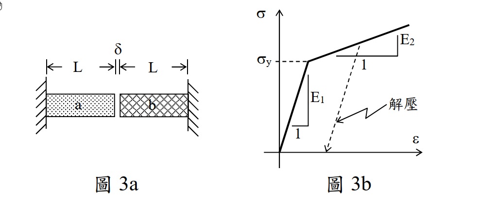

# MM-2025-3

**年份：** 2025（民國 114 年）第 3 題  
**主考點：** MM-U4-1（軸力桿件、扭力桿件與梁之塑性分析）  
**副考點：** MM-U3-1（軸力桿件變位及內力分析）  
**解析方法：** 塑性分析  
**標籤：** `雙線性彈塑性` · `溫度應力` · `間隙問題` · `靜不定軸力` · `應變硬化` · `逐段降伏` · `N-ΔT關係曲線`

---

## 解析來源

[原始解析](../../raw/solutions/MM-2025-3/MM-2025-3.md)

## 互動圖

- [stress-strain 互動圖](../../raw/solutions/MM-2025-3/MM-2025-3-stress-strain-viz.html)

## 附圖

## 相關概念

> 概念連結在 ingest 時由解析內容自動萃取。

## 出現考點

| 考點 | 類型 |
|------|------|
| MM-U4-1（軸力桿件、扭力桿件與梁之塑性分析）| 主考點 |
| MM-U3-1（軸力桿件變位及內力分析）| 副考點 |

*本頁由 `ingest MM-2025-3` 自動生成。最後更新：2026-06-29*
